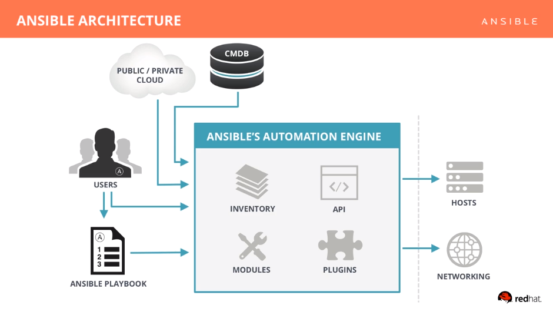

# Ansible Schulung

---

## Allgemeines

### Wozu gehört ansible?

Ansible ist ein sogenanntes Konfigurationsmanagement/Konfigurationsmanagementsystem,
in dieser Gruppe befinden sich auch diverse andere Tools

* terraform
* puppet
* chef
* salt
* cobbler

----

### Ziele von Konfigurationmanagementsystemen

* Anforderungen an die Infrastruktur manifestieren
* Nachvollziehbarkeit von Konfigurations anpassungen
* Manuelle Arbeiten minimieren
* Zustände des Systems definieren und reprodozieren können
* Testbarkeit der Infrastruktur erhöhen

----

### Programmiertyp von ansible

Puppet und Chef sind deklarative Tools/Programmiersprachen.

* hier steht die Beschreibung des Problems im Vordergrund.

Genaueres dazu findet man hier: https://de.wikipedia.org/wiki/Deklarative_Programmierung

Ansible wirkt auf den ersten Blick auch wie eine deklarative Programmiersprache ist aber in Wirklichkeit eine imperative Sprache, da Tasks beschrieben werden und diese von Oben nach unten Abgearbeitet werden..
Ansible muss auch wie alle anderen Tools für Idempotenz sorgen, bedeutet das mehrfache Ausführung eins Tasks oder Playbooks zum selben Ergebniss  führt.

----

### Fazit Ansible und Co. vs Golang Java und Co.

Golang Java und derivate sind imperative Proggramiersprachen. Puppet Chef und im Ansatz auch Ansible sind deklarativ.

#### Einfach gehlaten

Als Entwickler (Golang, Java und Co.) beschreibt man den Weg (zum Ziel)!
Mit Automatisierungsprachen beschreibt man das Ziel (ohne den Weg)!

----

#### Quellen

* https://jaxenter.de/ansible-puppet-chef-vergleich-54794
* Wikipedia:
  * https://de.wikipedia.org/wiki/Deklarative_Programmierung
  * https://de.wikipedia.org/wiki/Imperative_Programmierung

(mit Vorbehalt ohne gewähr.)

---

## Installation

Ansible wird einfach über den Packet manager installiert, oder über pip.

```shell
sudo apt-get update
sudo apt-get install software-properties-common
sudo apt-add-repository ppa:ansible/ansible
sudo apt-get update
sudo apt-get install ansible
```

## Prüfen ob alles geht

Prüfen ob ansible "funktioniert"

```shell
# ansible --version
ansible 2.5.0
  config file = /etc/ansible/ansible.cfg
  configured module search path = [u'/root/.ansible/plugins/modules', u'/usr/share/ansible/plugins/modules']
  ansible python module location = /usr/lib/python2.7/dist-packages/ansible
  executable location = /usr/bin/ansible
  python version = 2.7.12 (default, Dec  4 2017, 14:50:18) [GCC 5.4.0 20160609]
```

Note: [Weitere Infos](https://docs.ansible.com/ansible/intro_installation.html)

---

## Ansible erstes Verständnis

Ansible ist als CLI Tool nutzbar und kann somit sehr einfach ausgeführt werden.

Erstellen wir im ersten Beispiel einen neuen Nutzer:

### Erstes beispiel

```shell
ansible localhost -m "user" -a "name=kathie state=present home=/home/kathie"
```

```shell
ubuntu | SUCCESS => {
    "changed": true,
    "comment": "",
    "create_home": true,
    "group": 1000,
    "home": "/home/kathie",
    "name": "kathi",
    "shell": "",
    "state": "present",
    "system": false,
    "uid": 1000
}
```

Ansible hat die "Resource" User mit dem namen Kathie angelegt.

----

### Das Selbe nochmal

Was passiert, wenn wir dieses Kommando noch einmal ausführen?

```shell
# ansible localhost -m "user" -a "name=kathie state=present home=/home/kathie"

ubuntu | SUCCESS => {
    "append": false,
    "changed": false,
    "comment": "",
    "group": 1000,
    "home": "/home/kathie",
    "move_home": false,
    "name": "kathie",
    "shell": "",
    "state": "present",
    "uid": 1000
}
```

----

### Das Selbe ein wenig anders

Verändern wir nun den Kommentar (comment) des Nutzers und schauen was passiert.

```shell
# ansible localhost -m "user" -a "name=kathie state=present home=/home/kathie comment='Kathie Wiese"

ubuntu | SUCCESS => {
    "append": false,
    "changed": true,
    "comment": "Kathie Wiese",
    "group": 1000,
    "home": "/home/kathie",
    "move_home": false,
    "name": "kathie",
    "shell": "",
    "state": "present",
    "uid": 1000
}
```

Dabei fällt auf, dass "changed" nun wieder auf "true" steht und der Kommentar nun nicht mehr leer ist.

----

### ansible adhoc commands

ansible ist ein CLI Tool, das einfach einzusetzen ist.

```shell
# ansible localhost -m "user" -a "name=kathie state=present home=/home/kathie comment='Kathie Wiese"
```

* localhost beschreibt hier die Hosts auf denen der Lauf ausgeführt werden soll.
* -m gibt das Modul an, das ausgeführt werden soll
* -a Beschreibt die Parameter für das Modul, das mit -m übergeben wurde z.B. "user"

----

#### Check mode

Prüft die gegebene Situation auf dem System, ändert aber nichts.
Nicht alle Module unterstützen den check mode, diese werden übersprungen.
Dieser kann mit -C benutzt werden

```shell
ansible localhost -C -m package -a "name=vi state=latest"
```

#### Beispiele

```shell
ansible <inventory> options
ansible localhost -a /bin/date
ansible localhost -m ping
ansible localhost -m package -a "name=vi state=latest"
ansible localhost -C -m package -a "name=vi state=latest"
```

----

### Aufgabe:

* Installiert das Programm nginx über die Kommandozeile.
* Deinstalliert das Programm wieder.

---

## Was ist ansible

* ansible ist eine simple "automation-language"
* außerdem ist ansible auch die "automation engine" die "playbooks" ausführt

### Was kann ansible

* Config Management
* App Deployment
* Provisionierung
* Continous Delivery
* Security Compliance
* Orchistration

----

## Kernziele

* Einfachheit
  * "Human readable"
  * Simples yaml Format
  * Jeder soll Ansible lesen und verstehen können ohne es zu kennen
  * Simple Struktur, Code wird immer von oben nach unten ausgeführt (in order)
  * Schnell "produktiv" gehen
* Powerfull
  * "einfach" anwendbar auf bestehende Infrastruktur
  * Workflow Automatisierung
  * "Lifecycle" Automatisierung
* Agentless
  * benötigt nur SSH Zugriff (oder WinRM)
    * keine weiteren Firewall-Konfigurationen nötig...
  * keine "clients", die man ausnutzen oder aktuell halten muss.

### Zielsetzung

Ansible versucht, jeden schnell an die Automatisierung von IT-Infrastruktur/Prozessen zu bringen und dabei Komplexität zu verringern.

----

## Unterschied zu anderen Programmiersprachen

Ansible ist eine Sprache, die den zu erreichenden Zustand beschreibt, nicht wie man zu dem Zustand kommt.

## Architektur & Aufbau Bild



[Quelle](https://www.ansible.com/resources/videos/quick-start-video)

---

## Ansible - Playbooks

Der eben erstellte User sollte noch existieren, versuchen wir ihn nun wieder zu löschen.
Hierfür benutzen wir nun einen "task" und das Subtool "ansible-playbook"

### Zu Beginn
Erstellen wir eine Datei auf dem Server mit folgendem Inhalt:


```yml
---
- hosts: localhost
  tasks:
  - name: ensure user Kathie Wiese
    user:
      name: kathie
      comment: "Kathie Wiese"
      state: absent
```

Nach dem Speichern kann man nun folgenden Befehl ausführen:

```shell
# ansible-playbook user_absent.yml

PLAY [localhost] **************************************************************************************************************************************************************************************************

TASK [Gathering Facts] ********************************************************************************************************************************************************************************************
ok: [localhost]

TASK [ensure user Kathie Wiese] ***********************************************************************************************************************************************************************************
changed: [localhost]

PLAY RECAP ********************************************************************************************************************************************************************************************************
localhost                  : ok=1    changed=1    unreachable=0    failed=0
```

Ein weiteres Ausführen des Befehls wird keine Änderungen vornehmen:

```shell
# ansible-playbook user_absent.yml

PLAY [localhost] **************************************************************************************************************************************************************************************************

TASK [Gathering Facts] ********************************************************************************************************************************************************************************************
ok: [localhost]

TASK [ensure user Kathie Wiese] ***********************************************************************************************************************************************************************************
ok: [localhost]

PLAY RECAP ********************************************************************************************************************************************************************************************************
localhost                  : ok=2    changed=0    unreachable=0    failed=0
```

Cool, somit habt ihr euren ersten play geschrieben und ausgeführt.

----

### ansible-playbook

Ansible playbook ist das tool um ansible "plays" und "playbooks" auszuführen.

* Ein Playbook benutzt "plays"
* Ein Play benutzt "tasks"
* Ein Task benutzt "module"
  * Diese laufen sequentiell ab

----

#### Host & Users

Für jeden Play oder Playbook muss man sich entscheiden, für welchen Host und mit welchem User dieser ausgeführt werden soll.

```yml
# examples/plays/user_absent.yml
---
- hosts: localhost # diese Zeile beschreibt, für welche hosts der Play oder das Playbook ausgeführt werden soll.
  remote_user: root # beschreibt, als welcher user der Play ausgeführt werden soll.
```

[Genaueres Infos](http://docs.ansible.com/ansible/latest/user_guide/intro_patterns.html)

----

#### Modul Deklarierung

Schauen wir uns die Deklaration eines "modules" unter dem Punkt: "Tasks" genauer an.
Es gibt viele verschiedene Module in Ansible und diese sind immmer recht ähnlich aufgebaut.
Bleiben wir bei unserer "Kathie"

```yml
# examples/plays/user_absent.yml
- name: "ensure user Kathie Wiese" # ein task braucht immer einen namen der dann zur laufzeit angezeigt wird
  user: # das modul in unserem falle user
    # die "übergabe Werte" des User-Moduls
    name: kathie
    comment: "Kathie Wiese"
    state: absent
```

----

#### Tasks

Solche "snippets" werden Tasks genannt. Diese beinhalten einzelne Module für eine bestimmte Gruppe von Hosts.

Dies ist auch immernoch mit "ansible" ausfühbar:

```shell
ansible localhost -m user -a "name=kathie comment='Kathie Wiese' state=absent"
```

Was das user Modul sonst noch so kann findet man hier: http://docs.ansible.com/ansible/latest/modules/user_module.html

----

#### Module

* Kontrollieren System-Resourcen
* Ansible besitzt ~ 450 standard Module
  * Ziel: Einfachheit

### Beispiele

Weitere kleine Beispiele liegen in examples/plays
[Infos zu Standard-Modulen](http://docs.ansible.com/ansible/devel/modules/modules_by_category.html)

### Ein wenig Mehr

Nun haben wir einen kleinen Task erledigt, machen wir nun etwas mehr.
Installieren wir SSHD und sorgen dafür das er beim Systemstart immer ausgeführt wird, eigentlich sollte hier nichts passieren.

```yml
---
- hosts: localhost
  remote_user: root
  tasks:
  - name: ensure package ssh
    package:
      name: openssh-server
      state: present
  - name: ensure that ssh server is running
    service:
      name: sshd
      enabled: true
      state: started
```

Der einzige große Unterschied zu vorher ist, das wir eine weitere Task-Definition haben, auch ohne großes Ansible-Verständis ist dieser "Definition leicht lesbar".

Ergebnis:

```shell
PLAY [localhost] **************************************************************************************************************************************************************************************************

TASK [Gathering Facts] ********************************************************************************************************************************************************************************************
ok: [localhost]

TASK [ensure package ssh] ***************************************************************************************************************************************************************************************
changed: [localhost]

TASK [ensure that ssh server is running] *******************************************************************************************************************************************************************************
changed: [localhost]

PLAY RECAP ********************************************************************************************************************************************************************************************************
localhost                  : ok=3    changed=0    unreachable=0    failed=0
```

Lasst uns das Prüfen.

```shell
# systemctl status sshd
```

---

#### Datei Verwaltung

Ansible kann nicht nur Pakete und Benutzer verwalten sondern auch Dateien, heirfür gibt es mehrere Möglichkeiten.

Zurück zu unserem vorherigen Beispiel sshd, lass uns dieses etwas erweitern.

```yaml
<snip>
  - name: ensure etc/banner
    file:
      state: directory
      dest: /etc/banner
      owner: root
  - name: copy isssue.net
    copy:
      src: issue.net
      dest: /etc/banner/issue.net
      owner: root
  - name: Enable issue.net Banner
    lineinfile:
      path: /etc/ssh/sshd_config
      regexp: '^Banner='
      line: 'Banner=/etc/banner/issue.net'
</snip>

```

```shell
PLAY [localhost] ***************************************************************

TASK [Gathering Facts] *********************************************************
ok: [localhost]

TASK [ensure etc/banner] *******************************************************
changed: [localhost]

TASK [copy isssue.net] *********************************************************
changed: [localhost]

TASK [Enable issue.net Banner] *************************************************
changed: [localhost]

PLAY RECAP *********************************************************************
localhost                  : ok=4    changed=3    unreachable=0    failed=0
```

All diese Module sind Standard-Module und lange nicht alle, was machen diese denn genau?
[Eine Liste aller "File" Module](http://docs.ansible.com/ansible/latest/modules/list_of_files_modules.html)

##### Module: file

Dieses Modul beschreibt den Zustand einer Datei.
http://docs.ansible.com/ansible/devel/modules/file_module.html

##### Module: copy

Kopiert Daten vom "Server" System zum Ziel System.
http://docs.ansible.com/ansible/latest/modules/copy_module.html#copy

##### Module: lineinfile

Es ist auch möglich, nur einzelne Teile einer Datei zu verändern und den Rest unverändert zu lassen.
http://docs.ansible.com/ansible/latest/modules/lineinfile_module.html#lineinfile

----

#### Zusammenfassung

Nun haben wir schon einiges gesehen:

* Ansible Plays
* Das Zusammenführen von mehreren Tasks in einem Play
* Manipulation von "services", Dateien, Paketen und Benutzern

----

#### Aufgabe

Schreibe einen Play der Folgendes Erledigt:

* Nginx installieren
* Service nginx starten
* Service nginx bei jedem start mit hochfahren
* Eine rudimentaere "Welcome Page"

---

## [Ansible - Variablen](http://docs.ansible.com/ansible/latest/user_guide/playbooks_variables.html)

* Variablen helfen Playbooks unterschiedlich auszuführen
* Diese kann man aus mehreren Quellen beziehen:
  * Command Line
  * Den Playbooks selbst
  * Files
  * Inventory (group vars, host vars)
  * Vom Ziel System (Facts)
  * Ansible Tower

Variablen werden in Ansible fast immer mit {{ }} umklammert und in Playbooks zusätzlich mit "".
Dies ist ein sehr komplexes Thema, deshalb wird auch hier nur auf die Basics eingegangen.

----

### Variable auf der Kommando Zeile

Variablen in der Commandline werden mittels -e key=value angegeben, diese können dann im kompletten Ansible-Kontext verwendet werden.

#### Beispiel

htop installieren:

```shell
ansible localhost -e htop_ensure=present -m package -a "name=htop state={{ htop_ensure }}"
```

htop deinstallieren:

```shell
ansible localhost -e htop_ensure=present -m package -a "name=htop state={{ htop_ensure }}"
```

----

### Variablen im Playbook

```yaml
---
- hosts: localhost
  remote_user: root
  vars:
    user_comment: "Kathie Wiese"
  tasks:
  - name: ensure user Kathie Wiese
    user:
      name: kathie
      comment: "{{ user_comment }}"
      state: present
```

----

### Facts

#### Variablen vom Ziel System

```shell
ansible localhost -m setup
```

```yml
localhost | SUCCESS => {
    "ansible_facts": {
        "ansible_apparmor": {
            "status": "disabled"
        },
        "ansible_architecture": "x86_64",
        "ansible_bios_date": "07/04/2017",
        "ansible_bios_version": "1.3.7",
        "ansible_cmdline": {
            "acpi_backlight": "vendor",
            "cryptdevice": "/dev/nvme0n1p2:cryptroot",
            "initrd": "\\initramfs-linux.img",
            "root": "/dev/mapper/cryptroot",
            "rw": true
        },
        "ansible_date_time": {
            "date": "2018-04-17",
            "day": "17",
            "epoch": "1523978477",
            "hour": "15",
            "iso8601": "2018-04-17T15:21:17Z",
            "iso8601_basic": "20180417T152117234552",
            "iso8601_basic_short": "20180417T152117",
            "iso8601_micro": "2018-04-17T15:21:17.234600Z",
            "minute": "21",
            "month": "04",
            "second": "17",
            "time": "15:21:17",
            "tz": "UTC",
            "tz_offset": "+0000",
            "weekday": "Tuesday",
            "weekday_number": "2",
            "weeknumber": "16",
            "year": "2018"
        },
...
```

Wow, was ein Haufen, all diese Variablen sind im ansible Play nutzbar.
Dieser Vorgang nennt sich bei Playbooks gathering_facts und wird vor jedem Play für jeden Host ausgeführt.
Dies kann man aber auch deaktivieren, falls man diese Variablen nicht braucht:

```yml
hosts: localhost
remote_user: root
gathering_facts: no # deaktiviert diese
tasks:
...
```

### [Register](http://docs.ansible.com/ansible/latest/user_guide/playbooks_variables.html#registered-variables)

### [Variablen Scope](http://docs.ansible.com/ansible/latest/user_guide/playbooks_variables.html#variable-precedence-where-should-i-put-a-variable)

---

## [Ansible - Simple Templates](http://docs.ansible.com/ansible/latest/modules/template_module.html)

Jetzt hat man all den Kram, wie wendet man das nun sinnvoll an?

### Zu Beginn

```yaml
hosts: localhost
remote_user: root
gathering_facts: no
vars:
  issue_text: "Welcome to my server"
tasks:
  - name: "Templating issue.net"
    template:
      src: issue.net.j2
      dest: /etc/banner/issue.net
      owner: root
      group: root
      mode: 0644
```

```shell
# cat issue.net.j2
Ansible generated message:
{{ issue_text }}
```

---

## [Ansible - Einfache Schleifen](http://docs.ansible.com/ansible/devel/user_guide/playbooks_loops.html)

In Ansible sind Schleifen möglich um komplexere Aufgaben zu erledigen.

http://docs.ansible.com/ansible/devel/user_guide/playbooks_loops.html
http://docs.ansible.com/ansible/latest/user_guide/playbooks_special_topics.html

## [Ansible - When Statement](http://docs.ansible.com/ansible/latest/user_guide/playbooks_conditionals.html)

## [Ansible - Inventories](http://docs.ansible.com/ansible/latest/user_guide/intro_inventory.html)

### Zu Beginn

Ansible benötigt eine Liste von Zielen auf denen die Playbooks ausgeführt werden können.

* Statisch eingetragene Server
* Custom geschriebenes Zeug
* Dynamische generierte Server Listen aus der Cloud oder sonstigem Tools (AWS, Consul, Google, uvm...)

Zurück zum Anfang:

```shell
ansible localhost -m user -a "name=kathi state=absent"
```

Hier an zweiter Stelle sagen wir ansible auf welchen Hosts das Modul ausgeführt werden soll.
Bei ansible-playbook tun wir dies im Playbook.

```yaml
- hosts: localhost #<----
  remote_user: root
  tasks:
  - name: ensure user Kathie Wiese
    user:
      name: kathie
      comment: "Kathie Wiese"
      state: absent
```

Woher bezieht ansible diese Daten?

---

### Hosts und Gruppen

Ansible benutzt dafür eine "Inventory Datei", diese liegt zuallererst in /etc/ansible/inventory, dies ist aber auf viele Arten änderbar. z.B. mit -i.

```shell
cat examples/inventory/static_inventory
```
```yaml
localhost

[webservers] # definiert eine Gruppe von Servern
foo.example.com # definiert die Rechner in der Gruppe
bar.example.com:1337

[dbservers]
one.example.com ansible_host=192.168.0.66 ansible_port=5512 # der Host hat keinen DNS Eintrag deshalb kann dieser verändert werden.
two.example.com
three.example.com
```

Es gibt noch weitere Methoden wie INI und YAML Format.

#### Pattern

Um es mal erwähnt zu haben, auch Patterns sind möglich.

```yaml
[desktop]
pc-bn-[01:50]

```

#### Connection Types

Sowie connection Types

```yaml
[client]
localhost              ansible_connection=local
other1.example.com     ansible_connection=ssh        ansible_user=mpdehaan
```

#### Aufgabe

* Schreibt ein Inventory für euren Play und führt diesen über eine Gruppe aus. Das Inventory könnt ihr mit -i angeben.

```shell
ansible-playbook -i inventory play.yaml
```

### Host & Gruppen Variablen

Es ist möglich, für Hosts und Gruppen Variablen festzulegen, diese können in Plays individuell genutzt werden.

### Standard Gruppen

* all
  * Beinhaltet alle hosts
* ungrouped
  * Beinhaltet alle hosts die in keiner weiteren Gruppe sind.

### Aufgabe

Ändert euren Play so ab, dass dieser von eurem Rechner eine anderes System provisioniert.

## [Ansible - Roles](http://docs.ansible.com/ansible/latest/user_guide/playbooks_reuse_roles.html)

ansible-galaxy ist hier dein Freund und Helfer.

---

### Struktur

```shell
ansible-galaxy init ansible-nginx
```

```shell
ansible-nginx/
|-- README.md
|-- defaults
|   `-- main.yml
|-- files
|-- handlers
|   `-- main.yml
|-- meta
|   `-- main.yml
|-- tasks
|   `-- main.yml
|-- templates
|-- tests
|   |-- inventory
|   `-- test.yml
`-- vars
    `-- main.yml
```

#### Aufgabe

Machen wir aus dem bisherigen Play ein richtiges Playbook.

### [Includes](https://docs.ansible.com/ansible/2.4/playbooks_reuse_includes.html)

### [Handlers](http://docs.ansible.com/ansible/latest/user_guide/playbooks_intro.html#handlers-running-operations-on-change)

## [Ansible-Environment](http://docs.ansible.com/ansible/latest/reference_appendices/config.html#ansible-configuration-settings)

Ansible ist auf viele Arten Konfigurierbar. Standard-Suchpfade für ansible.cfg sind:

* ANSIBLE_CONFIG (environment variablen sollten sie gesetzt sein)
* ansible.cfg (im aktuellen Verzeichnis)
* ~/.ansible.cfg (im User Home)
* /etc/ansible/ansible.cfg

### [Ansible Konfigurations Datei](http://docs.ansible.com/ansible/latest/installation_guide/intro_configuration.html)

Sample

```shell
[defaults]
inventory         = ./inventory
host_key_checking = False
log_path          = /tmp/ansible.log
roles_path        = ./roles
```

### [Mehr zu ansible-galaxy](http://docs.ansible.com/ansible/latest/reference_appendices/galaxy.html)

ansible Galaxy ist eine Webseite, auf der man seine Playbooks hochladen und "veröffentlichen" kann.
Dort findet man auch viele bereits fertige Playbooks, welche aber mit Vorsicht zu genießen sind, meist erfüllen sie nicht genau den Zweck. Allerdings sind diese sehr gut für Anregungen oder als Ausgangspunkt, sofern die Lizens dies zulässt.

#### [requirements.yml](http://docs.ansible.com/ansible/latest/reference_appendices/galaxy.html#installing-multiple-roles-from-a-file)

Installieren von dependencies aus der galaxy ist möglich.

```yml
# from galaxy
- src: yatesr.timezone

# from GitHub
- src: https://github.com/bennojoy/nginx

# from GitHub, overriding the name and specifying a specific tag
- src: https://github.com/bennojoy/nginx
  version: master
  name: nginx_role

# from a webserver, where the role is packaged in a tar.gz
- src: https://some.webserver.example.com/files/master.tar.gz
  name: http-role

# from Bitbucket
- src: git+http://bitbucket.org/willthames/git-ansible-galaxy
  version: v1.4

# from Bitbucket, alternative syntax and caveats
- src: http://bitbucket.org/willthames/hg-ansible-galaxy
  scm: hg

# from GitLab or other git-based scm
- src: git@gitlab.company.com:mygroup/ansible-base.git
  scm: git
  version: "0.1"  # quoted, so YAML doesn't parse this as a floating-point value
```

### Aufgabe

Erstellt ein gekapseltes environment, was ansibleenv heißt und roles aus ansibleenv/roles bezieht.

## Erweitert

### [Ansible Galaxy](http://docs.ansible.com/ansible/latest/reference_appendices/galaxy.html)

* https://galaxy.ansible.com/

### [Tests](http://docs.ansible.com/ansible/latest/reference_appendices/test_strategies.html)

* Check Mode
* Playbooks Tests
* [Asserts](http://docs.ansible.com/ansible/latest/reference_appendices/test_strategies.html)

### [Jinja2](https://docs.ansible.com/ansible/devel/user_guide/playbooks_templating.html)

---

Ende
